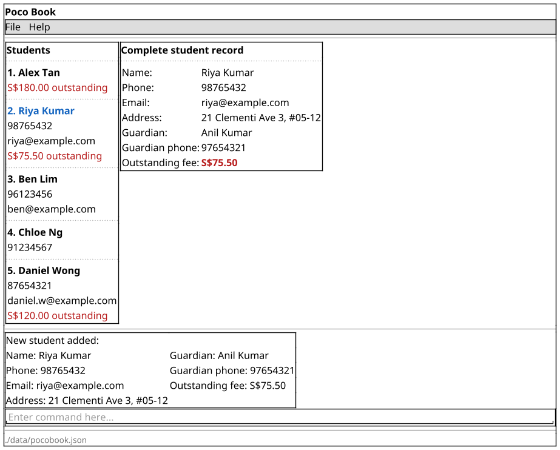

# Poco Book

Poco Book is a desktop app that helps independent tutors manage their students, guardian contacts and outstanding fees. It is built for tutors who type fast, so every action is a short command.

## Features

* Add a student with guardian contact details and an optional outstanding fee
* List, find and view students
* See which students owe fees, then set or clear their outstanding amounts
* Delete students who have left

## Documentation

* [User Guide](https://ay2627s1-cs2103t-f09-2a.github.io/tp/UserGuide.html)
* [Developer Guide](https://ay2627s1-cs2103t-f09-2a.github.io/tp/DeveloperGuide.html)
* [About Us](https://ay2627s1-cs2103t-f09-2a.github.io/tp/AboutUs.html)

## Acknowledgements

This project is based on the AddressBook-Level3 project created by the [SE-EDU initiative](https://se-education.org).
