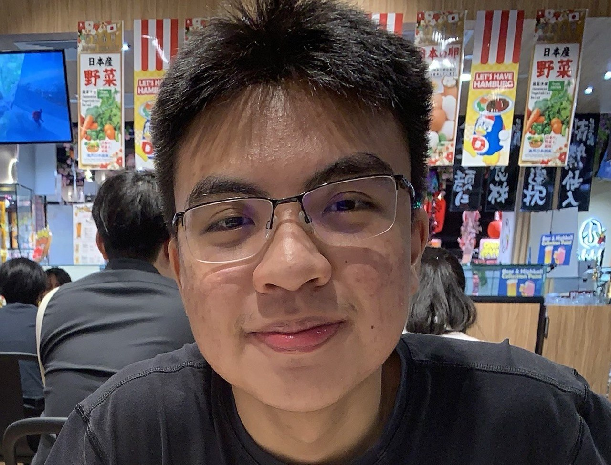

We are a team based in the [School of Computing, National University of Singapore](https://www.comp.nus.edu.sg).

You can reach us at the email `seer[at]comp.nus.edu.sg`

## Project team

### Yu Tianle

[[github](https://github.com/EL-NAIT)]

* Role: Developer
* Responsibilities: Viewing a student's complete record (`view`) in a details pane; outstanding-fee labels on student cards; DG use cases.

### Maneerat Apicha

[[github](https://github.com/Suki899)]

* Role: Developer
* Responsibilities: Adding students with guardian and fee information (`add`); guardian contact fields; README and UI mock-up.

### Zhang Yilin

[[github](http://github.com/yiilinzhang)]

* Role: Developer
* Responsibilities: Finding students by name (`find`) and deleting students (`delete`); regression tests for `find` and filtered-list indexes; Update developer Guide target user, value proposition and user stories accordingly.

### Suvan Handa

[[github](https://github.com/suvan1911)]

* Role: Developer
* Responsibilities: Outstanding-fee value modelling; persistence of guardian contact and outstanding-fee data; related model and storage tests; project website settings and repository links.

### Zhao Shizhen

[[github](https://github.com/shiverin)]

* Role: Developer
* Responsibilities: Outstanding-fee filtering (`fees`) and payment-status updates (`paid`); related feature specifications, tests, and documentation; Developer Guide non-functional requirements and glossary.
